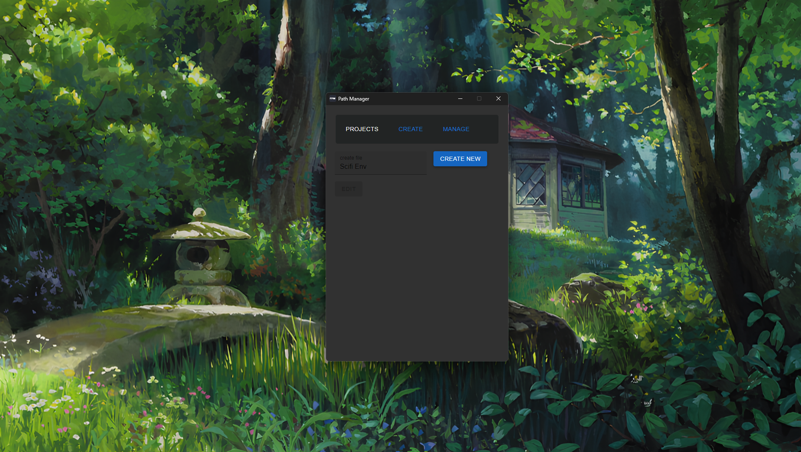
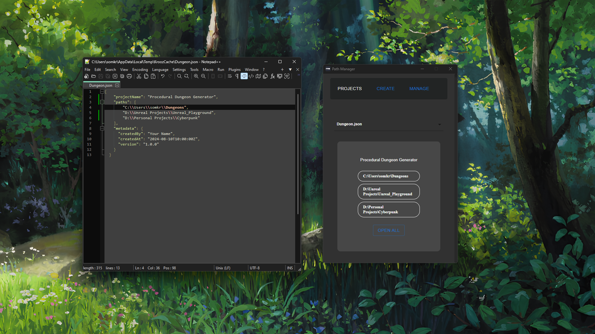

# Project File Manager

An Electron application with React and TypeScript

This Application is for Handling many files and directories at one place mainly for handling
project which has to go back and forth between different folders you can store all the paths
in this application and handle files better.

Also i wanted to learn more about the types in typescript :-[]

## Project Setup

### Install

```bash
$ npm install
```

### Development

```bash
$ npm run dev
```

### Build

```bash
# For windows
$ npm run build:win

# For macOS
$ npm run build:mac

# For Linux
$ npm run build:linux
```

### Preview

<hr>
<hr>
<hr>
